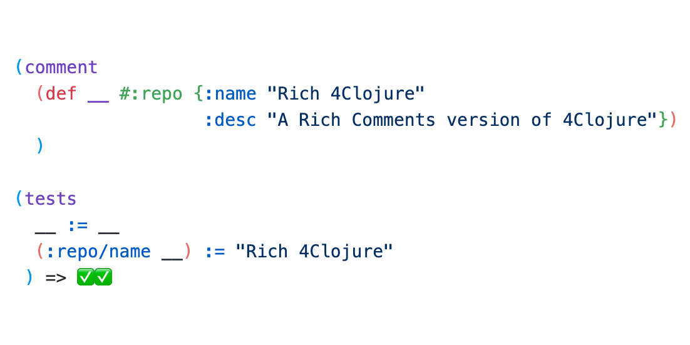

# Rich 4Clojure

*Practice Clojure using Interactive Programming in your editor.*

 

Welcome to the [Rich Comment Form](https://calva.io/rich-comments/) (RCF) port of 4Clojure! ❤️

## What it is

1. A repository that lets you learn and practice [Clojure](https://clojure.org), directly from the comfort of a Clojure REPL enhanced editor. (From your web browser, With zero installs, if you like.)
2. A ”copy” of the now closed **4clojure.com** site. It served us so wonderfully well!

_Anyway, if you have come here to practice Clojure, you are at the right place!_

## How it works

You solve programming problems using Clojure and your editor of choice. The problems are designed in increasing difficulty levels. You can use it to take your first baby steps in the language and also to hone your Clojure skills.

## Get started

To get to where you can start solving problems there are basically two alternatives:

1. Using [Calva](https://calva.io) in your browser ([Gitpod](https://gitpod.io)).
1. Use your machine.
    1. With **Calva**
    1. With some other editor with Clojure abilities

### Calva in Gitpod - Zero installs!

This repository is prepared for [Gitpod](https://gitpod.io) such that both the [Clojure tools](https://clojure.org/guides/deps_and_cli) and [Calva](https://calva.io) are installed.

That means you can start training Clojure like so by opening https://gitpod.io/#https://github.com/PEZ/rich4clojure in your web browser.

It sometimes takes quite a while (even 5+ minutes) for the environment to be prepared. Grab some coffee. 😄

Then you will see VS Code in your browser! And the [instructions for how to use Rich 4Clojure](doc/INSTRUCTIONS.md) will be opened for you. The instructions also contains information for what to do if you are new to Clojure and/or Calva.

#### OK, so what is Gitpod?

Gitpod is a development environment that runs in your web browser. It uses [VS Code](https://code.visualstudio.com). You can open any **GitHub**/**GitLab**/**Bitbucket** repository in the Gitpod development environment by prepending the repository URL with `https://gitpod.io/#`. That's how this repository's Gitpod URL is constructed:

[https://gitpod.io/#https://github.com/pez/rich4clojure](https://gitpod.io/#https://github.com/pez/rich4clojure)

See https://gitpod.io for the full story.

### On your machine

This option can be easy, if you have Java and the Clojure tools installed and you know how to work with Clojure projects in your editor. It can also be a bit cumbersome if you don't. (In this case, I suggest you use Gitpod first and have some fun with the 4Clojure problems before you invest the time to figure out how to install the things.)

Once you have Java and the Clojure tools installed:

0. Clone this repo to your machine.

If you are using VS Code, install Calva and follow the same instructions as for the Gitpod option above, from step 2 and on.

If you are using some other editor:

1. Open the project in your Clojure-enabled editor.
1. Start the project REPL and connect it to your editor session.
1. Load the file `dev/repl.cljc`.
    * This will enable the test runner to run the problem tests that you find in each problem file.
    * If you are using Calva Jack-in as per above, this will be done automatically for you.
1. Open [doc/INSTRUCTIONS.md](doc/INSTRUCTIONS.md) to find out how to use **Rich 4Clojure** to practice Clojure.

## What about the name?

The name, **Rich 4Clojure**, comes from the fact that it relies on [Rich Comments](https://calva.io/rich-comments/) and also uses a test utility called [RCF](https://github.com/hyperfiddle/rcf) which is building on the same philosophy. Also, reading it like ”rich forclosure”, haha (or something)!

## Work in progress

This is an early version from a quite automated translation of the original problems. There'll be dragons. Please consider filing issues, starting [discussions](https://github.com/PEZ/rich4clojure/discussions), or chat me up on the [Clojurian's Slack](http://clojurians.net/) (I'm **@pez**, there).

PR:s are also welcome. If it is the content of a particular problem you want to suggest changes for, edit the `etc/problems.edn` file.

## Quirks

I'll collect known/discovered quirks here if they are show stoppers.

### Zero install failing

The Gitpod option can fail installing (I know, the irony) the Calva extension if you have adblockers/etcetera active on the Gitpod site. See [Issue #9](https://github.com/PEZ/rich4clojure/issues/9) for clues and workarounds.

## Support the project

Consider starring ⭐ this repository, pretty please. 🙏

Please also consider contributing. Issues and pull requests are welcome. Right now the ”other editor” instructions can improve greatly, especially with **Editor X** configuration added to this repository. Please consider sending PRs with instructions and settings for your favorite editor.

The [Discussions](https://github.com/PEZ/rich4clojure/discussions) tab is also there for us to discuss both the project and solutions.

If you want to contrubute with problems, that is also super welcome. I suggest you start that with adding it as a suggestion in [Discussions](https://github.com/PEZ/rich4clojure/discussions). Then, if we agree the problem should be added, add it as a PR to the `etc/problems.edn` file, and I will generate the files and gists from it. (Until I've set up a CI/CD pipeline.)

If you want to encourage my work with this project you are welcome to sponsor me:

* [Sponsor Peter Strömberg a.k.a. PEZ](https://github.com/sponsors/PEZ) ❤️

## See also

* [4ever-clojure](https://4clojure.oxal.org) – A web based ”always up” copy of the original 4Clojure. It has listings of all working solutions that that were submitted to the original site.
